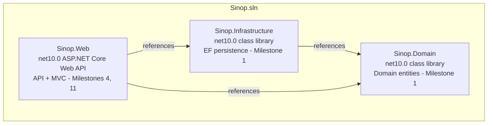
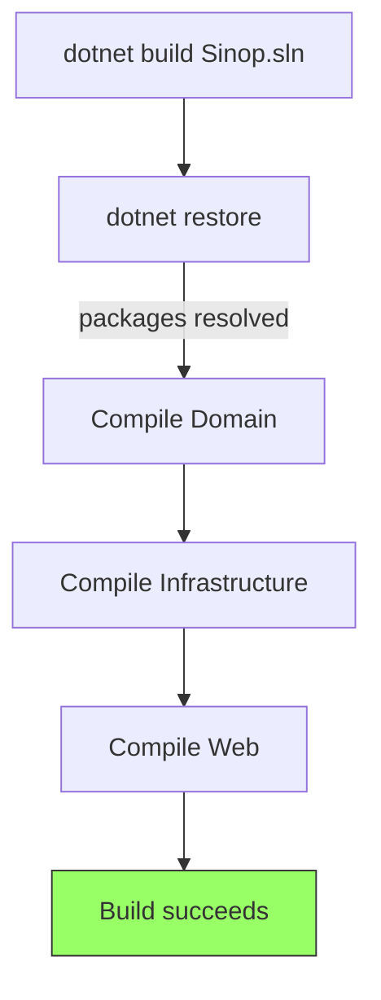
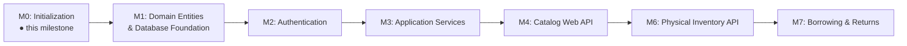

# FLOWCHARTS.md — Milestone 0: Project Initialization

## Solution Structure Flowchart

```mermaid
flowchart TD
    subgraph Solution["Sinop.sln"]
        Domain[Sinop.Domain<br/>net10.0 class library<br/>Domain entities - Milestone 1]
        Infra[Sinop.Infrastructure<br/>net10.0 class library<br/>EF persistence - Milestone 1]
        Web[Sinop.Web<br/>net10.0 ASP.NET Core Web API<br/>API + MVC - Milestones 4, 11]
    end

    Infra -->|references| Domain
    Web -->|references| Domain
    Web -->|references| Infra
```

## Build / Restore Flow

```mermaid
flowchart TD
    Start[dotnet build Sinop.sln] --> Restore[dotnet restore]
    Restore -->|packages resolved| Compile[Compile Domain]
    Compile --> CompileInfra[Compile Infrastructure]
    CompileInfra --> CompileWeb[Compile Web]
    CompileWeb --> Done[Build succeeds]

    style Done fill:#9f6,stroke:#333
```

## Milestone Execution Order (per CLAUDE.md §17)

```mermaid
flowchart LR
    M0[M0: Initialization<br/>● this milestone] --> M1[M1: Domain Entities<br/>& Database Foundation]
    M1 --> M2[M2: Authentication]
    M2 --> M3[M3: Application Services]
    M3 --> M4[M4: Catalog Web API]
    M4 --> M6[M6: Physical Inventory API]
    M6 --> M7[M7: Borrowing & Returns]
```
